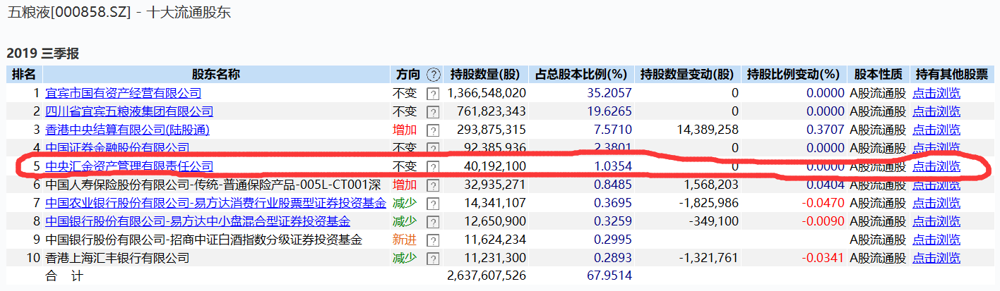
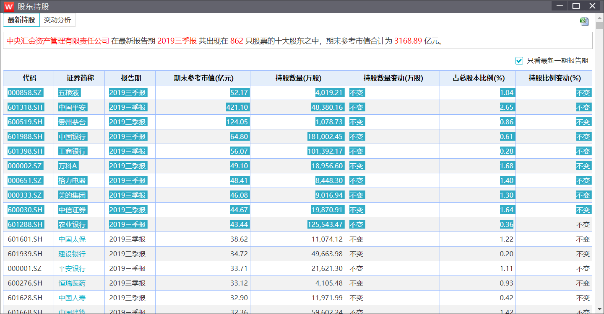

# Shareholding-of-National-Team
根据模板数据(从Wind复制即可),生成该季度国家队持股变动情况

数据模板保存在template文件夹下：

1. **您需要更新template_all_company.xlsx中的全部A股数据，我已经使用wind函数写好，您只需要打开一次，修改日期值为当前季度末然后待数据更新完毕后保存即可**
2. **您需要提供上季度的综合数据，可从上个季度数据复制，格式与template_last.xlsx一致，并将其命名为last.xlsx,请注意后缀一定为.xlsx！**
3. **您需要提供当前季度的数据，从万得数据库复制，复制后的格式应与template_data.xlsx文件一致，包括证金，汇金，以及中证金融资管的十个基金，命名为data.xlsx**

为什么需要模板数据呢？因为没有这种结构化的数据，最终的结果数据很难求，而且没有wind接口可以调用。所以你只需要手动将最基本的数据复制一下，保证数据的结构一致。复制下来即可，不需要改动任何列名，Sheet名或者其他任何，只需要重命名文件。

##### 复制data.xlsx的方法: 

1. 随便选一家公司，以五粮液为例：点击：点击浏览

   

2. 直接从开始复制，这个是汇金的，包括证金，其他的国家队等，**详见模板数据**

   

##### 源码见：